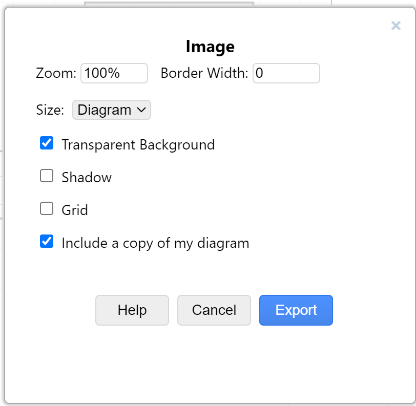

### Note about files

The files in this directory are generated from the UML files in the `src` directory.
Changes to those files necessitate a regeneration or export.

#### To export from DrawIO:

To create a Word-friendly file:

* Select the diagram via `Ctrl/Cmd-A`
* Select File/Export As... / PNG ...
* In the dialog box select
  * Transparent Background
  * Include a copy of my diagram
* Select export, and out file in the out folder.
* Ideally, save with a .png file ending.
* Commit file to GIT for ease of use for Word document author

#### Future direction

In the future, we can create a GitHub action that recreates the PNGs upon committing.

